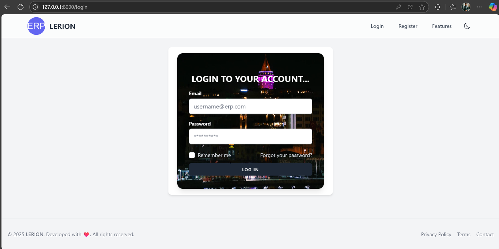
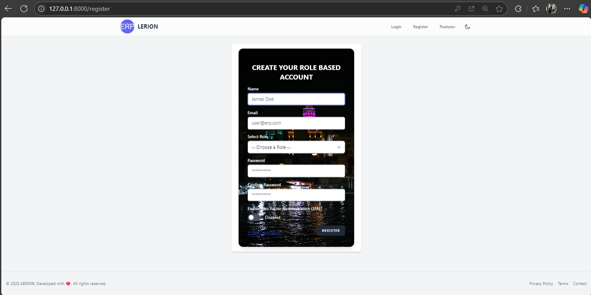
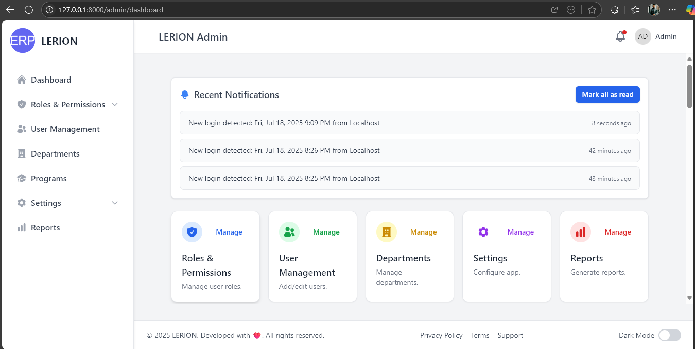
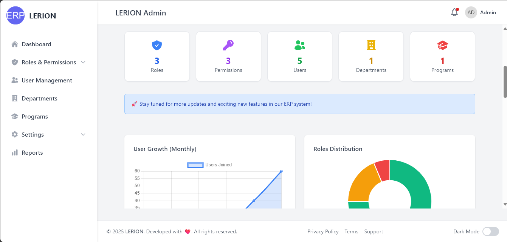
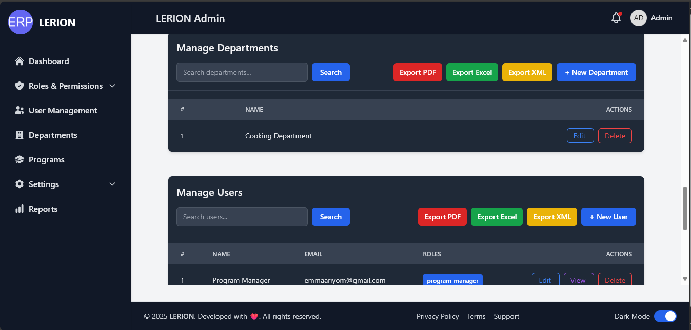

<p align="center">
    <a href="https://laravel.com" target="_blank">
        
    </a>
</p>

<p align="center">
    <a href="https://github.com/laravel/framework/actions"></a>
    <a href="https://packagist.org/packages/laravel/framework"></a>
    <a href="https://packagist.org/packages/laravel/framework"></a>
    <a href="https://packagist.org/packages/laravel/framework"></a>
</p>

---

# 🗂️ Laravel ERP System

A **modular, role-based ERP dashboard** built with Laravel, designed for scalable management of users, programs, and departments. This project demonstrates a simple best practices in Laravel architecture, UI/UX, and security, and is suitable for onboarding, NGO, or enterprise use.

---

## 🚀 Features

### 🎯 Role-Based Authentication & Dashboards using Spatie

  - Secure login/register with role-based dashboard redirection:
  - **Admin**
  - **Program Manager**
  - **Care Support**
  - Secure User Authentication with Email Verification
  - Location-aware Login Notifications
  - Middleware-protected roles['admin', 'pm', 'support'] routes
  - Little Responsive UI powered by Tailwind CSS

### 🖥️ Admin Dashboard with Analytics and CRUD Operations:

- **Departments, Programs, Users** management
- Search, create, edit, and delete for each module
- Export data (PDF, Excel, XML) for each module
- Responsive, accessible, and consistent UI (light/dark mode)
- Notifications, activity logs, and audit trails (planned)
- Modular Blade components for easy customization

### 🖥️ Program Manger Dashboard

- **Programs** management
- Search, create, edit, and delete for each module
- Export data (PDF, Excel, XML) for each module
- Responsive, accessible, and consistent UI (light/dark mode)
- Notifications, activity logs, and audit trails (planned)
- Modular Blade components for easy customization

### 📊 Data Export

- Export tables to PDF (with watermark, branding, and metadata)
- Export to Excel and XML (placeholders, ready for implementation)

---

## 📁 Project Structure

```
├── app/
│   ├── Http/
│   │   └── Controllers/
│   │       └── Admin/
│   │           ├── DepartmentController.php
│   │           ├── ProgramController.php
│   │           └── UserController.php
│   └── Models/
│
├── bootstrap/
│   └── cache/
│
├── config/
│   ├── app.php
│   ├── auth.php
│   ├── permission.php
│   ├── session.php
│   └── ...
│
├── database/
│   ├── factories/
│   │   └── UserFactory.php
│   ├── migrations/
│   │   ├── create_users_table.php
│   │   ├── create_departments_table.php
│   │   ├── create_programs_table.php
│   │   └── ...
│   └── seeders/
│       ├── DatabaseSeeder.php
│       └── RolesSeeder.php
│
├── public/
│   ├── assets/
│   ├── videos/
│   ├── favicon.ico
│   └── index.php
│
├── resources/
│   ├── css/
│   ├── js/
│   ├── lang/
│   ├── views/
│   │   ├── admin/
│   │   │   ├── departments/
│   │   │   ├── programs/
│   │   │   ├── users/
│   │   │   ├── dashboard.blade.php
│   │   │   └── ...
│   │   ├── components/
│   │   ├── layouts/
│   │   ├── auth/
│   │   ├── pm/
│   │   ├── profile/
│   │   ├── vendor/
│   │   └── welcome.blade.php
│   └── markdown/
│
├── routes/
│   ├── web.php
│   ├── api.php
│   ├── auth.php
│   └── console.php
│
├── storage/
│   ├── app/
│   ├── framework/
│   └── logs/
│
├── tests/
│   ├── Feature/
│   ├── Unit/
│   └── TestCase.php
│
├── vendor/
│
├── .env
├── artisan
├── composer.json
├── package.json
├── vite.config.js
└── ...
```

---

## 🛠️ Tech Stack

- **Laravel Framework 12.8.1**
- **Blade** (templating)
- **Tailwind CSS** (UI styling)
- **PHP 8.2.26**
- **MySQL**
- **"barryvdh/laravel-dompdf": "^3.1",** (PDF export)
- **"erag/laravel-pwa": "^1.8",** (Progressive Web App Install)
- **"robthree/twofactorauth": "^3.0"** (2fa auth)
- ***...**

---

## 🔐 Security & Compliance

- CSRF, XSS, and input validation throughout
- Role-based access control (RBAC) using Laravel policies and middleware
- Password hashing, environment variable security
- GDPR/data privacy readiness (planned)

---

## 🧑‍💻 Getting Started

### 1. Clone & Install

```bash
git clone git@github.com:BroCode-glithch/erp.git
cd erp
composer install
cp .env.example .env
php artisan key:generate
```

### 2. Configure Database

Edit `.env` and set your database credentials.

### 3. Run Migrations

```bash
php artisan migrate
```

### 4. Seed the db with record

```bash
php artisan db:seed
```

### 4. Start Local Server

```bash
php artisan serve
```

---

## 📦 Usage

- Register as an admin, program-manager, and, Care-Support, to access the dashboard.
- Manage departments, programs, and users from the dashboard.
- Manage the system based on role management.
- Admin has full control over other roles.
- Setup **System Name**, **System Email**, and others.
- Use the search and export buttons in each section.
- Switch between light and dark mode for better UX.

---

## 📝 Project Roadmap

- [X] Laravel setup & authentication
- [X] Role-based login redirection
- [X] Admin dashboard UI
- [X] CRUD for departments, programs, users
- [X] PDF export with watermark and branding
- [X] Button styling and light/dark mode
- [ ] Excel/XML export
- [X] Program Manager & User dashboards
- [X] Notification system
- [ ] User activity logs
- [ ] Unit & feature tests
- [X] Responsiveness of portals on Mobile
- [ ] ...

---

## 😒 Challenges

- UI/UX Design of the admin, and program-manager dashboard
- System Name
- **Admin Dashboard Mobile Responsiveness** (Key Challenge)

---

## 🧪 Testing

- Factories and seeders for test data
- Example feature and unit tests (see `/tests`)

---

## 🛡️ License

This project is open-sourced under the MIT license.

---

## 🤝 Contributing

Pull requests are welcome! For major changes, please open an issue first to discuss what you would like to change.

---

## 📖 About Laravel

Laravel is a web application framework with expressive, elegant syntax. Learn more at [laravel.com](https://laravel.com).

---

## 📸 Screenshots

### Welcome Page


### Login Page


### Register Page


### Admin Dashboard Light



### Admin Dashboard DArk


---

## 🏆 Assessment Criteria (Self-Evaluation)

| Category        | Points (Max)   | My Progress (Status) |
| --------------- | -------------- | ------------- |
| Architecture    | 200            | *Pending* |
| Code Quality    | 150            | *Pending* |
| Features        | 200            | *Pending* |
| UI/UX           | 150            | *Pending* |
| Security        | 100            | *Pending* |
| Deployment      | 100            | *Pending* |
| Docs & Git      | 100            | *Pending* |
| **Total** | **1000** |               |

---

## 📋 Assessment Notes

- **Architecture & System Design:** Modular, scalable, and follows Laravel conventions.
- **Code Quality:** PSR-12, DRY, Eloquent, and reusable components.
- **Features:** Core modules (departments, programs, users) are implemented; RBAC and export working.
- **UI/UX:** Responsive, accessible, and customizable.
- **Security:** Standard Laravel protections in place.
- **Deployment:** Standard Laravel setup and .env configuration.
- **Documentation:** This README, in-code comments, and commit history.

---

> For a detailed scoring breakdown, please refer to the assessment rubric or contact the reviewer @    <a href="mailto://stephen.okwelume@lerionjakenwauda.com"></a>.

---
